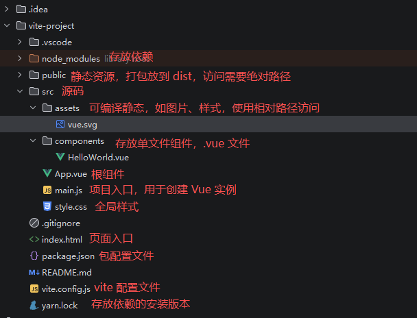

# Vue3

## 初识 Vue.js

### NodeJS

安装 Node.js：

https://nodejs.org/en/download

~~~shell
# node -v
v24.12.0
~~~

### 包管理工具

有 npm 和 yarn

#### npm

Node.js 默认包管理工具。

~~~shell
# npm -v
11.6.2

# 安装指定包
npm install 包名
npm i 包名

# -g 全局安装，不指定则安装到本项目中
npm install -g 包名

# 根据当前目录的 package.json 安装依赖包
npm install

# 卸载指定包
npm uninstall 包名

# 更新指定包
npm update 包名

# 设置镜像加速
npm config set registry https://registry.npmmirror.com

# 查看镜像地址
npm config get registry
~~~

#### yarn

Node.js 另一个包管理工具，使用前需要安装：

~~~shell
# 全局安装 yarn
npm install yarn -g

# 查看版本
yarn -v

# 设置镜像加速
yarn config set registry https://registry.npmmirror.com

# 查看镜像地址
yarn config get registry

# 安装指定包
yarn install 包名
yarn 包名

# 根据当前目录的 package.json 安装依赖包
yarn

# -g 全局安装，不指定则安装到本项目中
yarn install -g 包名

# 卸载
yarn remove 包名

# 更新
yarn up 包名

# 添加指定名称包
yarn add 包名
~~~

#### 区别

- npm 安装同一包，每次重新下载；yarn 缓存下载过的包，重复无需下载
- npm 按队列安装每个包；yarn 可以并行
- npm 输出信息冗长；yarn 简洁

### Vite

Vue2 使用 Vue CLI 创建，基于 Webpack 构建。

Vue3 使用 Vite，不需要使用命令进行安装，有 npm 或者 yarn 就可以使用 vite 创建项目，Vite 会作为开发依赖保存到 node_modules 中。

#### 手动方式创建

~~~shell
# npm
npm create vite@latest

# yarn
npm create vite
~~~

创建项目

~~~shell
# yarn create vite
yarn create v1.22.22
[1/4] Resolving packages...
[2/4] Fetching packages...
[3/4] Linking dependencies...
[4/4] Building fresh packages...

success Installed "create-vite@8.2.0" with binaries:
      - create-vite
      - cva
|
o  Project name:
|  vite-project
|
o  Select a framework:
|  Vue
|
o  Select a variant:
|  JavaScript
|
o  Use rolldown-vite (Experimental)?:
|  No
|
o  Install with yarn and start now?
|  Yes
|
o  Scaffolding project in F:\dev\code\frontend\vue\chapter01\vite-project...
|
o  Installing dependencies with yarn...
yarn install v1.22.22
info No lockfile found.
[1/4] Resolving packages...
[2/4] Fetching packages...
[3/4] Linking dependencies...
[4/4] Building fresh packages...
success Saved lockfile.
Done in 5.63s.
|
o  Starting dev server...
yarn run v1.22.22
~~~

或者通过 package.json 启动

~~~shell
# 启动
yarn dev

# 构建
yarn build
~~~

#### 模板方式创建

~~~shell
# npm
npm create vite@latest <项目名称> --template <模板名称>

# yarn
yarn create vite <项目名称> --template <模板名称>

# 案例
yarn create vite vue-project2 --template vue
~~~

### Vue3 目录结构



### 项目运行过程

执行 yarn dev 后，项目会根据 `src/main.js` 将 `src/App.vue` 渲染到 `index.html` 文件的指定区域。

## 开发基础

### 单组件样式

~~~vue
<script setup>
    // 写 JS，可以省略
</script>
 
<template>
	<!-- 每个组件最多一个，vue3 可以有多个根节点，vue2 只能有一个 -->
</template>

<style scoped>
    /* 写样式，style 可省略，scoped 代表只有当前生效 */
</style>
~~~

开发一个简单的组件：

~~~vue
<script setup>
</script>

<template>
  <div class="demo">Demo 组件</div>
</template>

<style scoped>
.demo {
  font-size: 22px;
  font-weight: bold;
}
</style>
~~~

### 数据绑定

#### 初识数据绑定

##### 定义数据

~~~vue
<script>
  export default { // 模块导出语法
    setup() { // vue3 函数，组合式 API 起点，可以在函数中定义数据和方法，通过 return 关键字返回对象，将对象中的数据暴露给模板和组件实例
      return { // 定义返回对象，对象中的数据就是页面中要显示的数据
        count: 0
      }
    }
  }
</script>
~~~

`setup` 语法糖

~~~vue
<script setup>
  const count = 0
</script>
~~~

##### 输出数据

通过 `{{ 数据 }}` 来替换

~~~vue
<script setup>
  const count = 0;
  const number = 0;
</script>

<template>
  {{count}}<br/>
  {{ number + 1}}
</template>
~~~

#### 响应式数据绑定

想要实现页面数据的更新，Vue 提供了 `ref()`，`reactive()`、`toRef()`、`toRefs()`。

##### ref() 函数

参数为**数据**。

~~~shell
# 定义数据
响应式数据 = ref(数据)

# 更改值
响应式数据.value = 新值
~~~

案例：

~~~vue
<script setup>
import {ref} from "vue";

const count = ref(0); // 定义响应式数据
    
setTimeout(() => {
  count.value = 1; // 2s 后修改值
}, 2000)
</script>

<template>
  {{ count }}
</template>
~~~

##### reactive() 函数

用于创建响应式**对象和数组**。

~~~shell
响应式对象或数组 = reactive(普通对象或数组)
~~~

案例：

~~~vue
<script setup>
import {reactive} from "vue";

const person = reactive({name: '张三', age: 10});
    
setTimeout(() => {
  person.name = '李四'
  person.age = 20
}, 2000)
</script>

<template>
  {{ person.name }} --   {{ person.age }}
</template>
~~~

##### toRef() 函数

将**响应式对象**中的**单个属性转换为响应式数据**。

~~~shell
响应式数据 = toRef(响应式对象, '属性名')
~~~

案例：

~~~vue
<script setup>
import {reactive, toRef} from "vue";

const person = reactive({name: '张三', age: 10});
const age = toRef(person, 'age') // 将响应式对象中的某个属性转换为响应式数据

setTimeout(() => {
  person.name = '李四'
  person.age = 20
}, 2000)
</script>

<template>
  {{ person.name }} -- {{ person.age }} -- {{ age }}
</template>
~~~

##### toRefs() 函数

将**响应式对象**中的**所有属性转换为响应式数据**。

~~~shell
响应式数据 = toRefs(响应式对象)
~~~

案例：

~~~vue
<script setup>
import {reactive, toRefs} from "vue";

const person = reactive({name: '张三', age: 10});
const {name, age} = toRefs(person) // 将响应式对象中的所有属性转换为响应式数据， 使用解构，这里的对象的值是共用的

setTimeout(() => {
  person.name = '李四'
  person.age = 20
}, 2000)
</script>

<template>
  {{ person.name }} -- {{ person.age }} -- {{ name }} -- {{ age }}
</template>
~~~

### 指令

#### 内容渲染指令

`{{}}`、`v-text`、`v-html`。

~~~shell
# 其中 v-html 会解析 HTML 标签，其他两个不会
<标签名>{{ 数据名 }}</标签名>
<标签名 v-text='数据名'></标签名>
<标签名 v-html='数据名'></标签名>
~~~

#### 属性绑定指令

v-bind，主要绑定标签的属性，比如 `input` 标签的 `placeholder`.

~~~shell
<标签名 v-bind:属性名="数据名"></标签名>
<标签名 :属性名="数据名"></标签名>

# 拼接，其中 list 是字符串、index 是属性
<div :id="'list' + index"></div>
~~~

案例：

~~~vue
<script setup>
const username = '请输入用户名';
const pwd = '请输入密码';
</script>

<template>
  <p><input type="text" v-bind:placeholder="username"></p>
  <p><input type="password" v-bind:placeholder="pwd"></p>
</template>
~~~

#### 事件绑定指令

v-on，给 DOM 元素绑定事件，如 click、input、keyup。

~~~shell
<标签名 v-on:事件名="事件处理器"></标签名>
<标签名 @:事件名="事件处理器"></标签名>
~~~

案例：

~~~vue
<script setup>

import {ref} from "vue";

const count = ref(0);
const add = () => count.value++

</script>

<template>
  {{ count }}<br/>
  <button @click="add">+</button>
</template>
~~~

#### 双向数据绑定 TODO

v-model 实现双向数据绑定，可以在 input、textarea、select 元素实现绑定

- textarea：绑定的是 value，input 事件
- input （text）：绑定的是 value，input 事件
- input（checkbox、radio）：绑定的是 checked 属性、change 事件
- select：绑定 option 中的 value，change 事件

修饰符：

- .number：用户输入的值转换为数值类型
- .trim：自动过滤用户输入的首尾空白字符
- .lazy：在 change 事件而非 input 事件触发更新数据

案例：

~~~vue
<script setup>

import {ref} from "vue";

const username = ref('张三');
const gender = ref('保密');

</script>

<template>
  <input type="text" v-model="username"><br/>
  {{ username}}<br/>
  <textarea cols="30" rows="10" v-model="username"></textarea><br/>


  <label><input type="radio" value="male" v-model="gender"> 男</label>
  <label><input type="radio" value="female" v-model="gender"> 女</label>
  <label><input type="radio" value="secret" v-model="gender"> 保密</label>
</template>
~~~

#### 条件渲染

##### v-if

本质是通过 DOM 元素来切换显示状态，只需要切换一次显示或隐藏。

~~~shell
# 第一种
<标签名 v-if="条件"></标签名>

# 第二种
<标签名 v-if="条件A">A</标签名>
<标签名 v-else-if="条件B">B</标签名>
<标签名 v-else="条件C">C</标签名>
~~~

案例：

~~~vue
<script setup>

import {ref} from "vue";

const score = ref('B');

</script>

<template>
  <div v-if="score === 'A'">A</div>
  <div v-else-if="score === 'B'">B</div>
  <div v-else>C</div>
  <button @click="score = 'A'">切换A</button>
  <button @click="score = 'B'">切换B</button>
  <button @click="score = 'C'">切换C</button>
</template>
~~~

##### v-show

原理是设置属性 display: none，适合频繁切换。

~~~vue
<script setup>

import {ref} from "vue";

const flag = ref(true);

</script>

<template>
  <div v-show="flag">v-show</div>
  <button @click="flag = !flag">切换</button>
</template>
~~~

#### 列表渲染

v-for

~~~shell
# 渲染数组列表，index 从 0 开始
<标签名 v-for="(item, index) in arr"></标签名>

# 渲染对象， name 是对象中的属性名，value 是属性值
<标签名 v-for="(value, name, index) in object"></标签名>

# 渲染数字列表，index 初始值为 1
<标签名 v-for="(item, index) in num"></标签名>

# 渲染字符串，基于每个字符遍历
<标签名 v-for="(item, index) in str"></标签名>

# 建议给每一项提供唯一值，绑定 key 会提高渲染性能，key 不能重复
<div v-for="item in items" :key="item.id"></div>
~~~

渲染数组列表案例：

~~~vue
<script setup>

import {ref} from "vue";

const arr = ref(['java', 'javascript', 'vue']);

</script>

<template>
  <div v-for="(item, idx) in arr" :key="idx"> {{idx}} : {{item}} </div>
</template>
~~~

根据对象数组渲染

~~~vue
<script setup>

import {ref} from "vue";

const arr = ref([
  {id: 1, name: 'zs', age: 19},
  {id: 2, name: 'ls', age: 22},
  {id: 3, name: 'ww', age: 13},
]);

</script>

<template>
  <div v-for="(item, idx) in arr" :key="idx"> {{ idx }} - {{ item.id }} - {{ item.name }}- {{ item.age }}</div>
</template>
~~~

渲染对象：

~~~vue
<script setup>

import {ref} from "vue";

const obj = ref({id: 1, name: 'zs', age: 19},);

</script>

<template>
  <div v-for="(value, name, idx) in obj" :key="idx"> {{ idx }} - {{ name }} - {{ value }}</div>
</template>
~~~

### 事件对象

有时需要获取事件发生时的一些信息，如事件类型、事发时间戳、事件被触发对应标签的属性值集合等。

通过事件方法获取：

~~~vue
<script setup>
// 这里 change 没接受参数，event 即事件对象
const change = event => console.log(event)

</script>

<template>
  <button @click="change">click</button>
</template>
~~~

通过 $event 获取事件对象

~~~vue
<script setup>

const change = event => console.log(event)

</script>

<template>
  <button @click="change($event)">click</button>
</template>
~~~

通过 event 控制 css：

~~~vue
<script setup>

import {ref} from "vue";

const num = ref(0)
const change = event => {
  num.value++
  if (num.value % 2 === 0) { // 通过奇偶，event 控制点击对象的 css
    event.target.style.border = '3px dotted'
  } else {
    event.target.style.border = '3px solid'
  }
}
</script>

<template>
  <div>{{ num }}</div>
  <button @click="change">click</button>
</template>
~~~

### 事件修饰符

#### 阻止默认行为

使用 `.prevent` 点击阻止默认行为时，页面不会发生跳转

~~~vue
<a href="test.html" v-on:click.prevent>阻止默认行为</a>
~~~

#### 阻止冒泡

.stop 用户点击单元素，会向上出发父元素，祖先元素，通过 `.stop` 可以阻止冒泡事件。

~~~vue
<script setup>

let show = message => console.log(message)

</script>

<template>
  <div @click="show('我是父元素事件')">
    <button @click="show('我是子元素的事件')">事件冒泡</button>
    <button @click.stop="show('我是子元素的事件')">阻止事件冒泡</button>
  </div>
</template>
~~~

#### 事件捕获

.capture 事件捕获是由外向内，和冒泡相反，即捕获后，外面先触发：

~~~vue
<script setup>

let show = message => console.log(message)

</script>

<template>
  <div @click.capture="show('我是父元素事件')"> <!--事件捕获，所以先触发父、再触发按钮-->
    <button @click="show('我是子元素的事件')">事件捕获</button>
  </div>
</template>
~~~

#### 只触发一次

.once 可以使事件只触发一次。

~~~vue
<script setup>

const show = () => alert('只触发一次')

</script>

<template>
    <button @click.once="show">只触发一次</button>
</template>
~~~

#### 自身触发

.self 只有自身触发事件才执行，别的时候不会执行，即使是子元素触发冒泡到 .self 元素，也不会执行；但是冒泡行为依然存在。

而 .stop 是阻止冒泡，不会冒泡到父元素。

~~~vue
<script setup>

let show = message => console.log(message)
</script>

<template>
  <div @click="show('我是祖先元素事件')">祖
    <div @click.self="show('我是父元素事件')">父
      <div @click="show('我是子元素的事件')">子</div>
    </div>
  </div>
</template>
~~~

上面案例：

- 点击子：输出：子、祖
- 点击父：输出：父、祖

#### 滚动监听

.passive 实现滚动监听，主要用于移动端：

~~~vue
<script setup>

let onScroll = () => console.log('滚动')
</script>

<template>
  <div class="box" @scroll.passive="onScroll">
    <div class="inner"></div>
  </div>
</template>

<style scoped>
.box {
  height: 200px;
  overflow-y: auto;
  border: 1px solid #ccc;
}

.inner {
  height: 5000px;
}
</style>
~~~

#### 捕获特定按键

- .enter
- .esc
- .tab
- .delete：捕获 Delete、Backspace
- .ctrl
- .alt
- .shift
- .meta：mac 的 command、windows 的 win

~~~vue
<script setup>

let submit = () => console.log('提交')
</script>

<template>
  <input type="text" @keyup.enter="submit">
</template>
~~~

在输入后点击 enter、alt+enter、ctrl+enter 都可以进行提交。

如果只想 .enter 生效，使用 .exact 修饰：

~~~vue
<script setup>

let submit = () => console.log('提交')
</script>

<template>
  <input type="text" @keyup.enter.exact="submit">
</template>
~~~

#### 鼠标捕获

- .left：左键
- .middle：中键
- .right：右键

~~~vue
<script setup>

let show = () => console.log('右键')
</script>

<template>
  <button @click.right="show">按键</button>
</template>
~~~

### 计算属性

可以实时监听数据的变化，返回一个计算的新值，并将计算结果缓存起来。只有计算属性中依赖的数据源变化了，计算属性才会重新自动求值，并重新加入缓存。

~~~shell
# 语法格式
const 计算属性名 = computed(() => {
  return 计算后的值
})
~~~

### 侦听器

想要在数据更新后进行相应操作，可以通过侦听器

~~~shell
# 侦听器来源
## 一个函数，返回一个值
## 一个响应式数据
## 一个响应式对象
## 一个由上面类型组成的数组

# 回调函数
## 第一个参数是新值
## 第二个参数是旧值

# 可选参数
## deep，当监听一个对象时，如果对象属性变化，无法监听，将该值设置为 true，则可以监听到
## immediate：组件初次加载完成不会加载侦听器，如果需要回调函数立刻调用，则设置为 true
watch(侦听器来源, 回调函数, 可选参数)
~~~

案例：

~~~vue
<script setup>

import {ref, watch} from "vue";

const cityName = ref('北京')

watch(cityName, (newVal, oldVal) => {
  console.log(newVal, oldVal)
})

</script>

<template>
  <input type="text" v-model="cityName">
</template>
~~~

### 样式绑定

#### 绑定 class

v-bind：可以绑定字符串、对象和数组。

**绑定字符串案例：**

~~~vue
<script setup>
const className = 'box'

</script>

<template>
  <div :class="className">你好</div>
</template>

<style scoped>
.box {
  border: 1px solid black;
}
</style>
~~~

**绑定对象案例：**

由于 isActive 是 true，所以结果为 `<div class="className">你好</div>`

~~~vue
<script setup>
import {ref} from "vue";

const isActive = ref(true)

</script>

<template>
  <div :class="{className: isActive}">你好</div>
</template>
~~~

v-bind 和 class 可以并存，结果为 `<div class="classNameDefault className">你好</div>`

~~~vue
<script setup>
import {ref} from "vue";

const isActive = ref(true)

</script>

<template>
  <div class="classNameDefault" :class="{className: isActive}">你好</div>
</template>
~~~

如果不想将对象的 class 属性直接卸载模板中，可以将属性定义为一个响应式对象或者一个返回对象的计算属性：

~~~vue
<script setup>
import {computed, ref} from "vue";

// 定义响应式对象
const classObj1 = ref({className: true})

// 定义计算属性
const isActive = ref(true)
const classObj2 = computed(
    () => ({
      className: isActive.value
    }) // 箭头函数 ({}) “返回一个对象字面量”时必须加的小括号
)

</script>

<template>
  <div :class="classObj1">你好1</div>
  <div :class="classObj2">你好2</div>
</template>
~~~

 将 class 属性绑定为数组：

~~~vue
<script setup>
import {ref} from "vue";

const className1 = ref('active')
const className2 = ref('error')

</script>

<template>
  <div :class="[className1, className2]">你好</div>
</template>
~~~

#### 绑定 style

**style 属性绑定为对象**

定义在模板中：

~~~vue
<script setup>
import {ref} from "vue";

const activeColor = ref('green')
const fontSize = ref('50')

</script>

<template>
  <div :style="{color: 'red', fontSize: '30px'}">1</div>
  <div :style="{color: activeColor, fontSize: fontSize + 'px'}">2</div>
</template>
~~~

定义在对象中：

~~~vue
<script setup>
import {ref} from "vue";

const style = ref({
  color: 'red',
  fontSize: '30px'
})

</script>

<template>
  <div :style="style">1</div>
</template>
~~~

**style 属性绑定为数组**

语法：

~~~shell
# 数组中每个元素都是一个对象
<div v-bind:style="[classObj1, classObj2]"></div>
~~~

## 组件基础上

### 选项式和组合式 API

#### 选项式 API

~~~vue
<script>
// 选项式 API：Vue2 / Vue3 均支持
export default {
  name: 'Demo',

  /* 局部注册子组件 */
  components: {},

  /* 响应式状态 */
  data() {
    return {
      count: 0,
      msg: 'Hello 选项式 API'
    }
  },

  /* 计算属性 */
  computed: {
    double() {
      return this.count * 2
    }
  },

  /* 方法 */
  methods: {
    increment() {
      this.count++
    }
  },

  /* 生命周期 */
  mounted() {
    console.log('Demo mounted')
  }
}
</script>
~~~

#### 组合式 API

~~~vue
<script>
import { ref, computed, onMounted, watch, defineComponent } from 'vue'

export default defineComponent({
  name: 'DemoStandard',
  setup() {
    const count = ref(0)

    const double = computed(() => count.value * 2)

    function increment() {
      count.value++
    }

    onMounted(() => console.log('DemoStandard mounted'))

    watch(count, n => console.log('count:', n))

    // 暴露给模板
    return { count, msg, double, increment }
  }
})
</script>
~~~

语法糖版本：

~~~vue

<script setup>
/* 组合式 API：<script setup> 语法糖 */
import { ref, computed, onMounted, watch } from 'vue'

// 响应式数据
const count = ref(0)

// 计算属性
const double = computed(() => count.value * 2)

// 函数
const f = function increment() {
  count.value++
}

// 生命周期
onMounted(() => {
  console.log('DemoSetup mounted')
})

// 侦听器
watch(count, newVal => {
  console.log('count 变化:', newVal)
})
</script>
~~~

选项式 API 是在组合式 API 基础上实现的。

组合式 API 可以将数据，方法放到一起，实现快速定位，阅读和维护。

### 生命周期函数

组件的生命周期是指每个组件从被创建到销毁的整个过程。

随着生命周期的变化，生命周期函数会自动执行，组合式 API 生命周期函数：

表格

复制

| 组合式 API        | 选项式 API      | 触发时机说明（官方顺序）                  |
| :---------------- | :-------------- | :---------------------------------------- |
| `onBeforeMount`   | `beforeMount`   | 模板编译已完成，但尚未挂载到真实 DOM      |
| `onMounted`       | `mounted`       | 已挂载到 DOM（最常用，发请求、拿节点）    |
| `onBeforeUpdate`  | `beforeUpdate`  | 响应式数据变更，虚拟 DOM 打补丁前         |
| `onUpdated`       | `updated`       | 组件 DOM 已更新完毕                       |
| `onBeforeUnmount` | `beforeDestroy` | 组件实例即将卸载（Vue2 叫 beforeDestroy） |
| `onUnmounted`     | `destroyed`     | 组件已卸载（Vue2 叫 destroyed）           |

案例：

~~~vue
<script setup>
import {onBeforeMount, onMounted} from "vue";

onBeforeMount(() => {
  console.log('DOM 元素渲染前', document.querySelector(".container"))
  // DOM 元素渲染前 null
})

onMounted(() => {
  console.log('DOM 元素渲染后', document.querySelector(".container"))
  // DOM 元素渲染后 <div class="container">container</div>
})
</script>

<template>
  <div class="container">container</div>
</template>
~~~

### 组件的注册和引用

Vue 中，可以将独立、可重复的部分封装成组件，实现引用。

#### 注册组件

Vue 提供两种注册组件的方式：全局注册和局部注册。

##### 全局注册

如果一个组件使用频率很高，很多组件都会引用该组件，推荐全局注册。

- 第一步先创建一个组件 MyComponent
- 第二部修改 main.js

~~~javascript
import { createApp } from 'vue'
import './style.css'
import App from './App.vue'

import MyComponent from "./components/MyComponent.vue"; // 新增部分

const app = createApp(App)

app.component ('MyComponent', MyComponent) // 新增部分，此处支持链式调用多个全局组件

app.mount('#app')
~~~

- 第三步使用：

~~~vue
<script setup>

</script>

<template>
  <div>App</div>
  <MyComponent/>
</template>

<style scoped>
</style>
~~~

##### 局部注册

如果组件只是在特定情况下使用，推荐局部注册。

例如在组件 A 中注册了组件 B，那么组件 B 只能在 A 中使用，不能在 C 中使用。

~~~vue
<script setup>
// 使用了 setup 语法糖，无需手动注册
import MyComponent from "./components/MyComponent.vue"; 

</script>

<template>
  <div>App</div>
  <MyComponent/>
</template>

<style scoped>
</style>
~~~

#### 引用组件

上面已经演示了

### 组件之间的样式冲突

默认情况下，组件样式是全局生效，这是由于单页 Web 中，所有组件 DOM 都是基于唯一的 index.html 呈现。

#### scoped

在 Vue 中，可以使用 `scoped` 属性和深度选择器来解决组件之间的冲突。

~~~vue
<script setup>
</script>

<template>
  <div class="font">App</div>
</template>

<style scoped>
.font{
  font-size: 20px
}
</style>
~~~

打开控制台可以看到

~~~css
.font[data-v-7a7a37b1] {
    font-size: 20px /* 自动添加了 data-v-xxx 属性 */;
}
~~~

#### 深度选择器

如果添加了 scoped，还想让其样式对子组件生效，可以使用深度选择器。

父组件：

~~~vue
<script setup>
import MyComponent from "./components/MyComponent.vue";
</script>

<template>
  <div>
    <div class="font">App</div>
    <MyComponent></MyComponent>
  </div>
</template>

<style scoped>
:deep(.font) {
  font-size: 20px
}

</style>
~~~

子组件：

~~~vue
<script setup>

</script>

<template>
  <p class="font">MyComponent</p>
</template>

<style scoped>

</style>
~~~

### 父组件向子组件传递数据

实际开发中，存在同一模块多个子组件请求同一份数据，如果每个都进行网络请求，代码冗余。

Vue 提供 props 语法，可以让父组件为子组件提供要展示的数据，即父组件请求即可，通过 props 将数据传递给子组件。

#### 声明 props

如果要接收父组件的数据，需要在子组件先声明 props。

在不使用 setup 语法糖：

~~~vue
<script>
export default {
    props:{
        自定义属性 A: 类型, // prop 的类型可以设置字符串、布尔、对象、数组等
        自定义属性 B: 类型,
        ...
    }
}
</script>
~~~

如果不限制 props 类型，可以声明字符串数组形式 props：

~~~vue
props: ['自定义属性 A', '自定义属性 B']
~~~

使用 setup 语法糖

~~~vue
<script setup>
	const props = defineProps({'自定义属性A': 类型, '自定义属性B': 类型})
</script>
~~~

之后就可以在子组件使用：

~~~vue
<template>
  {{自定义属性A}}
  {{自定义属性B}}
</template>
~~~

#### 静态绑定 props

如果传递给子组件的数据是固定不变的，可以通过静态绑定 props 的方式为子组件传递数据：

~~~shell
<子组件标签名 自定义属性A="数据" 自定义属性B="数据" />
~~~

案例：

父组件：

~~~vue
<script setup>
import MyComponent from "./components/MyComponent.vue";
</script>

<template>
  <div>
    App<br/>
    <MyComponent num="1"></MyComponent>
  </div>
</template>

<style scoped>
</style>
~~~

子组件：

~~~vue
<script setup>
defineProps({num: String})
</script>

<template>
  MyComponent: {{ num }}
</template>

<style scoped>

</style>
~~~

#### 动态绑定 props

父组件使用 v-bind 可以为子组件绑定 props，任意类型的值都可以传递给子组件。

##### 字符串

父组件:

~~~vue
<script setup>
import MyComponent from "./components/MyComponent.vue";
import {ref} from "vue";

const username = ref("张三")
</script>

<template>
  <div>
    App<br/>
    <MyComponent :init="username"></MyComponent> <!--通过 v-bind 绑定-->
  </div>
</template>
~~~

子组件：

~~~vue
<script setup>
defineProps(['init'])
</script>

<template>
  MyComponent: {{ init }}
</template>
~~~

##### 数字

~~~vue
<script setup>
import MyComponent from "./components/MyComponent.vue";
import {ref} from "vue";

const age = ref(18)
</script>

<template>
  <div>
    App<br/>
    <MyComponent :init="age"></MyComponent> <!--通过 v-bind 绑定-->
    <MyComponent :init="12"></MyComponent> <!-- 这里 12 是表达式，而不是字符串-->
  </div>
</template>
~~~

##### 布尔

~~~vue
<script setup>
import MyComponent from "./components/MyComponent.vue";
import {ref} from "vue";

const isFlag = ref(true)
</script>

<template>
  <div>
    App<br/>
    <MyComponent :init="isFlag"></MyComponent> <!--通过 v-bind 绑定-->
    <MyComponent :init="false"></MyComponent> <!-- 这里 false 是表达式，而不是字符串-->
  </div>
</template>
~~~

##### 数组

~~~vue
<script setup>
import MyComponent from "./components/MyComponent.vue";
import {ref} from "vue";

const arr = ref(['html', 'css', 'js'])
</script>

<template>
  <div>
    App<br/>
    <MyComponent :init="arr"></MyComponent> <!--通过 v-bind 绑定-->
  </div>
</template>
~~~

##### 对象

~~~vue
<script setup>
import MyComponent from "./components/MyComponent.vue";
import {ref} from "vue";

const obj = ref({
  id: 1,
  name: 'zs',
  age: 18
})
</script>

<template>
  <div>
    App<br/>
    <MyComponent :init="obj"></MyComponent> <!--通过 v-bind 绑定-->
    <MyComponent :init="obj.name"></MyComponent> <!--通过 v-bind 绑定-->
  </div>
</template>
~~~

#### 验证 props

##### 基础类型检查

指定基础类型检查：

~~~vue
props: {
	自定义属性 A: String,
	自定义属性 A: Number,
	自定义属性 C: Boolean,
	自定义属性 D: Array,
	自定义属性 E: Object,
	自定义属性 F: Date,
	自定义属性 G: Function,
	自定义属性 H: Symbol,
}
~~~

配置对象形式：

~~~vue
props: {
    自定义属性: { type: Number }
}
~~~

如果类型不唯一：

~~~vue
props: {
    自定义属性: { type: [Number, String] } // 可以包含多种类型
}
~~~

##### 必填

~~~vue
props: {
    自定义属性: { required: true }
}
~~~

##### 默认属性值

~~~vue
props: {
    自定义属性: { default: 0 }
}
~~~

##### 自定义校验函数

~~~javascript
defineProps({
  init: {
    type: String,
    required: false,
    default: '张三',
    validator(value) {
      const pattern = /^\S+@\S+\.\S+$/;
      return pattern.test(value);
    }
  }
})
~~~

### 子组件向父组件传递数据

通过自定义事件实现，需要在子组件声明和触发自定义事件，在父组件监听自定义事件。

#### 子组件声明自定义事件

~~~vue
<script>

export default {
  emits: ['demo']
}

</script>
~~~

语法糖：

~~~vue
<script setup>
defineEmits(['demo'])
</script>
~~~

#### 子组件触发自定义事件

~~~vue
<script setup>

defineEmits(['demo'])

</script>

<template>
  MyComponent:<br/>
  <!-- 第一个参数是事件名称，第二个参数是数据 -->
  <button @click="$emit('demo', 1)">按钮</button>
</template>
~~~

通过自定义方法：

~~~vue
<script setup>

const emit = defineEmits(['demo'])

const update = () => {
  emit('demo', 2)
}

</script>

<template>
  MyComponent:<br/>
  <!-- 第一个参数是事件名称，第二个参数是数据 -->
  <button @click="update">按钮</button>
</template>
~~~

#### 父组件中监听自定义事件

通过 v-on：

~~~vue
<子组件名 @demo="fun" />
~~~

通过上面的 update 按钮，传递 demo 事件到父组件：

~~~vue
<script setup>
import MyComponent from "./components/MyComponent.vue";

const fun = value => {
  alert(value)
}

</script>

<template>
  <div>
    App<br/>
    <MyComponent @demo="fun"></MyComponent> <!--通过 v-bind 绑定-->
  </div>
</template>
~~~

### 跨组件之间传递数据

上面的方式只能在子父组件之间传递数据，如果多层嵌套，则会很混乱。

Vue 提供了依赖注入，

- 为后代提供数据：通过 provide() 函数
- 为上层、整个应用提供数据：使用 inject() 函数

#### provide

~~~javascript
provide(注入名, 注入值)
~~~

- 注入名：后代组件通过注入名查找诸如之
- 注入值：可以是任何类型，包括响应式数据

不适用语法糖：

~~~vue
<script>
import {provide, ref} from "vue";

export default {
  components: {MyComponent},
  setup() {
    const count = ref(1);
    provide(
        'message', count
    )
  }
}

</script>
~~~

使用语法糖：

~~~vue
<script setup>
import {provide, ref} from "vue";

provide('message', ref(1))

</script>
~~~

全局依赖，修改 main.js：

~~~javascript
import { createApp } from 'vue'
import './style.css'
import App from './App.vue'

const app = createApp(App)

// 全局数据
app.provide('message', "hello vue")

app.mount('#app')
~~~

#### inject

通过 inject() 可以注入上层或为整个应用提供数据。

~~~javas
inject(注入值, 默认值, 布尔值)
~~~

- 注入值：vue 会遍历父组件，通过匹配注入所提供的值，如果有相同的，则取距离最近的组件
- 默认值（可选）：没匹配到取默认值
- 布尔值：如果为 false，第二个默认值则是工厂函数。

不使用语法糖：

~~~vue
<script>

import {inject} from "vue";

export default {
  setup() {
    const count = inject('count')

    // 注入一个值，如果为空，则返回 default value
    const foo = inject('foo', 'default value')

    // 当没有匹配到值，使用工厂函数
    const baz = inject('baz', () => new Map())

    const fn = inject('function', () => {
    }, false)
  }
}

</script>
~~~

使用语法糖

~~~vue
<script setup>

import {inject} from "vue";

const count = inject('count')

</script>
~~~

#### 案例

定义爷爷组件，提供了一个响应式数据和函数

~~~vue
<script setup>
import ProvideParent from "./ProvideParent.vue";
import {provide, ref} from "vue";

let money = ref(1000)
let updateMoney = (value) => money.value += value
provide('money', money)
provide('updateMoney', updateMoney)

</script>

<template>
  <div>爷爷组件</div>
  <hr/>
  <ProvideParent/>
</template>
~~~

定义父组件，只引入了子组件：

~~~vue
<script setup>

import ProvideChildren from "./ProvideChildren.vue";
</script>

<template>
  <div>父组件</div>
  <hr/>
  <ProvideChildren/>
</template>
~~~

定义子组件，通过 inject 获取爷爷组件的数据和函数：

~~~vue
<script setup>
import {inject} from "vue";

let money = inject('money')
let updateMoney = inject('updateMoney')
</script>

<template>
  <div>子组件</div>
  <hr>
  从爷爷收到 money: {{money}}
  <button @click="updateMoney(500)">增加金额</button>

</template>
~~~

## 组件基础下

### 动态组件

#### 定义动态组件

利用动态组件可以切换页面中显示的组件，使用 `<component>` 标签定义：

~~~html
<component is="要渲染的组件"></component>
~~~

component 必须和 is 属性配置使用。

is 的属性可以是字符串或组件，如果是组件，要实现组件的切换，则需要使用 `shallowRef()` 定义响应式数据。

案例：

定义左右组件：

~~~vue
<template>
MyLeft 组件
</template>

<template>
MyRight 组件
</template>
~~~

定义动态组件：

~~~vue
<script setup>

import MyLeft from "./MyLeft.vue";
import MyRight from "./MyRight.vue";
import {shallowRef} from "vue";

const showComponent = shallowRef(MyLeft)
</script>

<template>
  <button @click="showComponent = MyLeft">显示 Left 组件</button>
  <button @click="showComponent = MyRight">显示 Right 组件</button>
  <div>
    <component :is="showComponent"></component>
  </div>
</template>
~~~

#### keepAlive 实现组件缓存

使用动态组件切换时，隐藏的组件会被销毁，展示出来的组件会被重新创建，所以之前的组件状态就消失了。

使用缓存组件，可以使组件不会被销毁。

还是上面的案例，修改 MyLeft：

~~~vue
<script setup>
import {onMounted, onUnmounted, ref} from "vue";

const count = ref(0);
onMounted(() => {
  console.log("MyLeft 被挂载")
})

onUnmounted(() => {
  console.log("MyLeft 取消挂载")
})
</script>

<template>
  <div>
    MyLeft 组件
    count: {{ count }}
    <button @click="count++">按钮</button>
  </div>
</template>
~~~

使用 keepalive，在之前的动态组件中嵌套，然后看看效果：

~~~vue
<div>
    <keep-alive>
		<component :is="showComponent"></component>
    </keep-alive>
</div>
~~~

#### 组件缓存的生命周期函数

- `onActivated` ：组件**被切进来**（从缓存池恢复）时触发；首次挂载也会触发一次（在 `onMounted` 之后）。
- `onDeactivated` ：组件**被切出去**（被缓存）时触发；**不会**触发 `onUnmounted`。

~~~vue
<script setup>
import {onActivated, onDeactivated, ref} from "vue";

const count = ref(0);

onActivated(() => {
  console.log("MyLeft onActivated")
})

onDeactivated(() => {
  console.log("MyLeft onDeactivated")
})
</script>

<template>
  <div>
    MyLeft 组件
    count: {{ count }}
    <button @click="count++">按钮</button>
  </div>
</template>
~~~

#### keepalive 组件的常用属性

| 属性      | 类型                      | 默认值   | 说明                                                         |
| :-------- | :------------------------ | :------- | :----------------------------------------------------------- |
| `include` | `string | RegExp | Array` | -        | **只有**匹配的组件名会被缓存；支持逗号分隔、正则或数组。     |
| `exclude` | `string | RegExp | Array` | -        | **排除**匹配的组件名，优先级高于 `include`。                 |
| `max`     | `number`                  | -        | 最大缓存实例数，**LRU** 策略；超出后最久未用的实例会被销毁。 |
| `cache`   | `Cache` (高级)            | 内部自建 | 2.7+ 提供，可**自定义缓存对象**（Map-like），实现持久化等高级需求。 |

### 插槽

插槽 slot 顾名思义，就是为组件预留占位符，比如下面这个组件 button，里面预留的 slot 就是插槽，当父组件引用该组件时，可以将 slot 替换成传进去的值。

~~~html
<template>
  <button>
    <slot></slot>
  </button>
</template>
~~~

案例：

定义一个可复用组件：

~~~vue
<template>
  <div>测试插槽组件</div>
  <slot></slot>
</template>
~~~

父组件引用

~~~vue
<script setup>
import SubComponent from "./components/SubComponent.vue";
</script>

<template>
  父组件<br/>
  <SubComponent>
    你好
  </SubComponent>
</template>
~~~

输出：

~~~
父组件
测试插槽组件
你好
~~~

如果父组件引用的时候不传值，slot 则不显示，其他正常显示。

#### 具名插槽

当需要定义多个插槽时，需要具名插槽来区分。

使用方法：

~~~vue
<slot name="插槽名称"></slot>
~~~

案例：

定义子组件：

~~~vue
<script setup>
</script>
<template>
  <div class="container">
    <div>
      <slot name="header"></slot>
    </div>
    <div>
      <slot name="content"></slot>
    </div>
    <div>
      <slot name="foot"></slot>
    </div>
  </div>
</template>
~~~

定义父组件，使用时可以使用 **v-slot** 或者 **#** 

~~~vue
<script setup>
import SubComponent from "./components/SubComponent.vue";
</script>

<template>
  父组件<br/>
  <SubComponent>
    <template v-slot:header>
      头部区域
    </template>
    <template v-slot:content>
      内容区域
    </template>
    <template #foot>
      底部区域
    </template>
  </SubComponent>
</template>
~~~

#### 作用域插槽

父组件使用子组件定义的数据，就可以使用作用域插槽。

~~~~vue
<!-- 子组件 -->
<slot message="Hello Vue"></slot>

<!-- 父组件，通过 v-slot 接收，msg 是形参，可自定义 -->
<SubComponent v-slot="msg">
 <p>{{ msg }}</p>
</SubComponent>

<!-- 父组件，传过来的是对象，可以进行解构 -->
<SubComponent v-slot="{name, age}">
 <p>{{ name }}</p>
 <p>{{ age }}</p>
</SubComponent>
~~~~

具名的作用域插槽

~~~vue
<!-- 子组件 -->
<slot message="Hello Vue" name="header"></slot>

<!-- 父组件，通过 v-slot 接收，msg 是形参，可自定义 -->
<SubComponent>
 <template #header="msg">
   {{msg}}
 </template>
</SubComponent>
~~~

案例：

定义子组件

~~~vue
<script setup>
import {reactive} from "vue";

const user = reactive({name: 'zs', age: 18})
</script>
<template>
  <div class="container">
    <div>
      <slot message="hello 默认插槽"></slot>
    </div>
    <div>
      <slot message="Hello 具名插槽+ 作用域" name="content"></slot>
    </div>
    <div>
      <slot :user="user" name="footer"></slot>
    </div>
  </div>
</template>
~~~

父组件：

~~~vue
<script setup>
import SubComponent from "./components/SubComponent.vue";
</script>

<template>
  父组件<br/>
  <SubComponent>
<!--    <template v-slot="msg">-->
    <template v-slot:default="msg">
      {{ msg }}
    </template>
    <template v-slot:content="msg">
      {{ msg }}
    </template>
    <template #footer="{user}">
      <p>{{ user.name }}</p>
      <p>{{ user.age }}</p>
    </template>
  </SubComponent>
</template>
~~~

结果

~~~
父组件
{ "message": "hello 默认插槽" }
{ "message": "Hello 具名插槽+ 作用域" }
zs

18
~~~

### 自定义指令

TODO

### 引用静态资源

项目需要引入静态资源，可以从 public 和 src/assets 中取。

#### 通过 public 取

public 存放不可编译静态文件，需要绝对路径访问。

“public = 不编译、不哈希，上线后在站点根目录躺着，所以 src 永远以 `/` 开头。”

~~~vue

~~~

#### 通过 src/assets 取

~~~vue
<script setup>
import img from '../assets/vue.svg'
</script>

<template>
  
</template>
~~~

## 路由

### Vue Router 

使用 Vue Router4。

~~~shell
yarn add vue-router@4 --save
~~~

使用步骤：

- 定义路由组件
- 定义路由链接和路由视图
- 创建路由模块，导入并挂载

### 基本使用

首先定义两个子组件，用来跳转：

Home 组件：

~~~vue
<template>
  <div class="home-container">
    <h3>Home 组件</h3>
  </div>
</template>

<style scoped>
.home-container {
  min-height: 150px;
  background-color: #f2f2f2;
  padding: 15px;
}
</style>
~~~

About 组件：

~~~vue
<template>
  <div class="about-container">
    <h3>About 组件</h3>
  </div>
</template>

<style scoped>
.about-container {
  min-height: 150px;
  background-color: #f2f2f2;
  padding: 15px;
}
</style>
~~~

定义 App 组件：

~~~vue
<script setup>

</script>

<template>
  <div class="app-container">
    <h1>App 根组件</h1>
    <router-link to="/home">首页</router-link> <!--route-link 标签定义路由标签，与 path 对应 -->
    <router-link to="/about">关于</router-link>
    <hr/>
    <router-view></router-view> <!--路由视图由 router-view 定义 -->
  </div>
</template>

<style scoped>

.app-container {
  text-align: center;
  font-size: 16px;
}

.app-container a {
  padding: 10px;
  color: #000;
}

.app-container a.router-link-active { /* router-link-active 代表导航激活 */
  color: #fff;
  background-color: #000;
}

</style>
~~~

创建路由模块，在 src 下，创建 router.js

~~~javascript
import {createRouter, createWebHistory} from "vue-router";

import Home from './components/Home.vue'
import About from './components/About.vue'

const router = createRouter({
    history: createWebHistory(),
    routes: [
        {path: "/home", component: Home},
        {path: "/about", component: About}
    ]
})

export default router
~~~

挂载路由：

```javascript
import { createApp } from 'vue'
import './style.css'
import App from './App.vue'
import router from "./router.js";

const app = createApp(App)

app.use(router)

app.mount('#app')
```

### 路由重定向

在开发中，可能希望用户访问不同路径时，页面中显示同一个组件，这时候就需要路由重定向。

路由重定向可以使用户在访问一个 URL 地址时，强制跳转到另一个 URL 地址，从而显示特定的组件。

修改 src/router.js：

~~~javascript
const router = createRouter({
    history: createWebHistory(),
    routes: [
        {path: "/", redirect: '/home'},
        {path: "/home", component: Home},
        {path: "/about", component: About}
    ]
})
~~~

### 路由嵌套

路由嵌套：

~~~javascript
routes: [
    {
        path: "父路由地址",
        component: 父组件,
        children: [
            {path: "子路由1", component: 子组件1}, // 注意子路由不能带 /
        	{path: "子路由2", component: 子组件2}
        ]
    }
]
~~~

在组件中定义子路由链接语法：

~~~html
<router-link to="/父路由路径/子路由路径"></router-link>
~~~

案例：

在 components 新建目录 pages，创建两个子组件：

tab1：

~~~vue
<script setup>

</script>

<template>
  <div>Tab1组件</div>
</template>

<style scoped>
.div {
  text-align: left;
  background-color: #9dc4e5;
}
</style>
~~~

tab2：

~~~vue
<script setup>

</script>

<template>
  <div>Tab2组件</div>
</template>

<style scoped>
.div {
  text-align: left;
  background-color: #ffba00;
}
</style>
~~~

修改 About：

~~~vue
<script setup>
</script>
<template>
  <div class="about-container">
    <h3>About 组件</h3>
    <router-link to="/about/tab1">tab1</router-link>
    <router-link to="/about/tab2">tab2</router-link>
    <hr/>
    <router-view></router-view>
  </div>
</template>

<style scoped>
.about-container {
  min-height: 150px;
  background-color: #f2f2f2;
  padding: 15px;
}

.app-container a {
  border: 1px solid #ccc;
  border-radius: 5px;
  padding: 5px 10px;
  color: #000;
  margin: 0 5px;
}

.app-container a.router-link-active { /* router-link-active 代表导航激活 */
  color: #000;
  background-color: #deebf6;
}
</style>
~~~

修改 router.js

~~~javascript
import {createRouter, createWebHistory} from "vue-router";

import Home from './components/Home.vue'

const router = createRouter({
    history: createWebHistory(),
    routes: [
        {path: "/", redirect: '/home'},
        {path: "/home", component: Home},
        {
            path: "/about",
            component: ()=> import('./components/About.vue'), // 懒加载
            children: [
                {path: 'tab1', component: ()=> import('./components/pages/Tab1.vue')},
                {path: 'tab2', component: ()=> import('./components/pages/Tab2.vue')}
            ]

        }
    ]
})

export default router
~~~

### 动态路由

#### 监听

比如 URL 为 http://xxx/getUser/1，这里后面的 1 是用户 ID，可以有多个 ID，此时需要动态路由。

~~~javascript
{path: '/sub/:id', component: 组件}
~~~

需要注意的是，动态路由切换时，指向的都是同一个组件。如果想要在切换时做一些操作，需要在组件内部使用 watch 来监听：

~~~vue
<script setup>

import {useRoute} from "vue-router";
import {watch} from "vue";

const route = useRoute()
watch(() => route.path, path => {
  console.log('路由路径', path)
})
</script>
~~~

#### 获取动态路由的参数值

使用  $route.params  或者 props。

##### 通过 $route.params

首先定义一个电影组件 Movie：

~~~vue
<script setup>

</script>

<template>
  <div class="movie-container">
    <router-link to="/movie/1">电影1</router-link>
    <router-link to="/movie/2">电影2</router-link>
    <router-link to="/movie/3">电影3</router-link>
    <router-view></router-view>
  </div>
</template>

<style scoped>
.movie-container{
  min-height: 150px;
  background-color: #f2f2f2;
}

.movie-container a{
  padding: 0 5px;
  font-size: 18px;
  border: 1px solid #ccc;
  border-radius: 5px;
  color: #000;
  margin: 0 5px;
}
</style>
~~~

App 组件引用它

~~~vue
<router-link to="/movie">电影</router-link>
~~~

MovieDetail 组件：

~~~vue
<template>
  <p>电影：{{ $route.params.id }}</p>
</template>
~~~

路由中新增

~~~javascript
{
    path: "/movie",
    component: () => import('./components/Movie.vue'),
    children: [
        // 注意这里是 :id!!
        {path: ':id', component: () => import('./components/MovieDetail.vue')},
    ]

}
~~~

##### 通过 props

moveDetail:

~~~vue
<script setup>
const props = defineProps({
  id: String
})
</script>

<template>
  <p>电影：{{ id }}</p>
</template>
~~~

修改 router.js

~~~javascript
{
    path: "/movie",
    component: () => import('./components/Movie.vue'),
    children: [
        {path: ':id', component: () => import('./components/MovieDetail.vue'), props: true},
    ]

}
~~~

### 命名路由

前面定义路由时，都是在 to 中添加目标地址，不便于记忆，也不方便修改：

~~~vue
<router-link to="/movie/1">电影1</router-link>
~~~

通过 name 属性为路由匹配规则定义路由名称，实现明明路由。

~~~javascript
{path: '路由路径', name: '路由名称', component: '组件'}
// name 属性不能重复
~~~

在 router-link 中定义：

~~~html
<router-link :to="{ name: 路由名称, params: {参数名：参数值}  }"></router-link>
~~~

案例：

修改 App.vue，注意这里用的是 `:to`

~~~vue
<router-link :to="{ name: 'MovieDetail', params: { id: 3} }">跳转到 MovieDetail 组件 </router-link>
~~~

修改 router.js

~~~javascript
{
    path: "/movie",
    component: () => import('./components/Movie.vue'),
    children: [
        {
            path: ':id',
            name: 'MovieDetail',
            component: () => import('./components/MovieDetail.vue'),
            props: true
        },
    ]
}
~~~

### 编程式导航

`<router-link>` 是声明式导航。

Vue Router 提供 useRouter() 函数，来获取全局路由：

~~~vue
<script setup>

import {useRouter} from "vue-router";

const router = useRouter()

</script>

~~~

#### push

push() 会向历史记录中添加一天新纪录，以编程的方式获取一个新的 URL。

当用户点击浏览器后退按钮后，会回到之前的 URL。

~~~javascript
// 字符串路径
router.push('/about/tab1')

// 带有路径的对象
router.push({ path: '/abount/tab1' })

// 命名路由
router.push( {name: 'user', params: {userId： '001'} } )

// 查询参数 /user?userId:001
router.push( {path: '/user', query: {userId： '001'} } )

// 带有 hash 值，如 #user/admin
router.push({path: '/user', hash: '#admin'})
~~~

上述规则也适用于 `<router-link>` 的 to 属性。

在使用 path 时，params 会失效：

~~~javascript
const id = '123'

router.push( {name: 'user', params: { id } } ) // 跳转到 /user/001
router.push( {path: 'user/${id}' } ) // 跳转到 /user/001
router.push( {path: 'user', params: { id } } ) // 跳转到 /user
~~~

案例：通过 push() 实现 Home 跳转 MoveDetail 组件，并且获取 id 的值。

Home 组件：

~~~vue
<script setup>
import {useRouter} from "vue-router";

const router = useRouter()

const gotoMovie = movieId => {
  router.push({
    name: 'MovieDetail',
    params: {id: movieId}
  })
}
</script>

<template>
  <div class="home-container">
    <h3>Home 组件</h3>
    <a href="#" @click.prevent="gotoMovie(3)">跳转 MoveDetail</a>
  </div>
</template>
~~~

#### replace

和 push 方法类似，但是不会往历史记录中添加新纪录，而是替换历史记录中的当前记录。

~~~vue
router.replace({path: '/user'})

<router-link :to="{path: '/user'}" replace></router-link>
~~~

#### go

通过 go(1) 前进，go(-1) 后退

~~~javascript
const router = useRouter()
router.go(-1) // 回退
~~~

### 导航守卫

全局导航守卫：

- 前置：beforeEach()
- 后置：afterEach()

导航独享守卫：

- beforeEnter()：只适用于单个路由

组件导航守卫：

- beforeRouteEnter()：路由进入前触发
- beforeRouteUpdate()：路由更新前被触发
- beforeRouteLeave()：路由离开之前被触发

实际开发中，全局导航守卫比较常用：

~~~javascript
const router = createRouter()

// to 目标路由对象
// from 当前导航正要离开的路由对象
// next 函数，不接收时，默认允许用户访问每一个路由，接收的话，必须调用 next() 函数，否则不允许用户访问任何一个路由
router.beforeEach({to, from, next} => {} )
router.afterEach({to, from, next} => {} )
~~~

next：

- next()：执行下一个钩子函数
- next(false)：停留在当前页面
- next('/')：跳转到其他页面


## 网络请求和状态管理

### Axios

Axios 通过 Promise 封装了 Ajax 技术，功能更强大，也改善了用户浏览网页的体验。

Axios 是基于 Promise 的 HTTP 库，可以发送 get、post 等请求，作用域浏览器和 Node.js 中。

当运行浏览器时，使用 XMLHttpRequest 接口发送请求；当运行在 Node.js 时，使用 HTTP 对象发送请求。

**安装 Axios**

~~~shell
# npm
npm install axios

# yarn
yarn add axios
~~~

在项目中使用 Axios 时，通常是先将 Axios 封装成模块，然后在组件中导入模块：

~~~javascript
// 创建 src/axios/request.js
import axios from 'axios'

const request = axios.create({
    timeout: 2000 // 2s
})
export default request
~~~

在组件中导入模块：

~~~javascript
import request from './axios/request.js'
~~~

**get：**

~~~javascript
request({
    url: '请求路径',
    method: 'get',
    params: { 参数 }
}).then(res=> {
    console.log(res)
}).catch(error => {
    console.log(error)
})
~~~

**post:**

~~~javascript
request({
    url: '请求路径',
    method: 'post',
    data: { 参数 }
}).then(res=> {
    console.log(res)
}).catch(error => {
    console.log(error)
})
~~~

### mockjs

使用 mockjs 模拟后端接口：

~~~shell
yarn add mockjs
~~~

在 src/mock 下创建 books.json

~~~json
[
  {
    "id": 1,
    "name": "西游记",
    "author": "吴承恩"
  },
  {
    "id": 2,
    "name": "红楼梦",
    "author": "曹雪芹"
  },
  {
    "id": 3,
    "name": "水浒传",
    "author": "施耐庵"
  },
  {
    "id": 4,
    "name": "三国演义",
    "author": "罗贯中"
  }
]
~~~

在  src/mock/ 下创建 mockServer.js

~~~javascript
import Mock from 'mockjs'
import books from './books.json'

Mock.mock('/mock/getBooks', 'get', {
    code: 200,
    data: books
})
~~~

在 main.js 配置

~~~javascript
const app = createApp(App)

import './mock/mockServer.js'   // 新建 src/mock/index.js，把 Mock.mock 语句放这里

app.mount('#app')
~~~

使用 Axios 进行请求：

~~~vue
<script setup>
import request from './axios/request.js'

request({
  url: '/mock/getBooks',
  method: 'get',
}).then(res => {
  console.log(res.data)
}).catch(error => {
  console.log(error)
})

</script>
~~~

### Pinia

Pinia 是新一代轻量级状态管理库，允许跨组件或页面共享状态，解决了多组件间的数据通信，使数据操作更加简洁。

安装：

~~~shell
npm install pinia

yarn add pinia
~~~

#### 简单使用

```javascript
import {createApp} from 'vue'
import './style.css'
import App from './App.vue'

import {createPinia} from "pinia";

const app = createApp(App)

// 引入 pinia
const pinia = createPinia();
app.use(pinia)

app.mount('#app')
```

在 src/store 下创建 index.js：

~~~javascript
import {defineStore} from "pinia";

export const useStore = defineStore('storeId' // 状态容器管理名称, {
    state: () => { // 管理状态
        return {
            add: 0,
            reduce: 100
        }
    },
    getters: {}, //获取数据之前进行再次编译，从而得到新数据
    actions: { // 定义事件处理方法，可以同步异步操作
        increase() {
            this.add++
        },
        decrease() {
            this.reduce--
        }
    }
})
~~~

使用：

~~~vue
<script setup>

import {useStore} from "./store/index.js";
import {storeToRefs} from "pinia";

const store = useStore()
const {add, reduce} = storeToRefs(store)

const increment = () => {
  store.increase()
}
const reduction = () => {
  store.decrease()
}

</script>

<template>
  <div>
    <p>
      每次增加 1：
      <button @click="increment"> +</button>
      数字：{{ add }}
    </p>
    <p>
      每次减少 1：
      <button @click="reduction"> -</button>
      数字：{{ reduce }}
    </p>
  </div>
</template>
~~~

#### 模块化

在复杂项目中，如果多个模块都定义到一个 store 对象中，那么 store 非常大并且难以管理。

所以可以在 src/store 下创建多个 .js ，作为每个模块的 store。

#### 持久化

如果需要刷新了仍然保留之前的操作状态，就需要使用 Pinia 持久化插件 pinia-plugin-persist 实现

~~~shell
npm install pinia-plugin-persist
yarn add pinia-plugin-persist
~~~

修改 main.js

~~~javascript
import {createApp} from 'vue'
import './style.css'
import App from './App.vue'

import {createPinia} from "pinia";
import piniaPluginPersist from 'pinia-plugin-persist'

const app = createApp(App)

const pinia = createPinia();
pinia.use(piniaPluginPersist);
app.use(pinia)

app.mount('#app')
~~~

定义 store：

~~~javascript
import {defineStore} from "pinia";

export const useStore = defineStore('user', {
    state: () => {
        return {
            name: '张三',
            sex: '男',
            age: 18
        }
    },
    getters: {},
    actions: {
        changeAge() {
            this.age++
        }
    },
    persist: {
        enabled: true, // 开启持久化
        strategies: [
            {
                key: 'user', // 定义 store
                storage: sessionStorage // 支持 LocalStorage、sessionStorage
            }
        ]
    }
})
~~~

App.vue

~~~vue
<script setup>

import {useStore} from "./store/user.js";
import {storeToRefs} from "pinia";

const store = useStore()
const changeAge = () => store.changeAge()
const {name, sex, age} = storeToRefs(store)

</script>

<template>
  <div>
    姓名：{{ name }}<br/>
    性别：{{ sex }}<br/>
    年龄：{{ age }}<br/>
    <button @click="changeAge">+age</button>
  </div>
</template>

<style scoped>
</style>
~~~

#### 部分持久化

~~~js
import {defineStore} from "pinia";

export const useStore = defineStore('user', {
    state: () => {
        return {
            name: '张三',
            sex: '男',
            age: 18
        }
    },
    getters: {},
    actions: {
        changeAge() {
            this.age++
        },
        changeName() {
            this.name = '李四'
        }
    },
    persist: {
        enabled: true,
        strategies: [
            {
                key: 'user',
                storage: sessionStorage, // 支持 LocalStorage、sessionStorage
                paths: ['age'] // 这里只持久化 age
            }
        ]
    }
})
~~~


